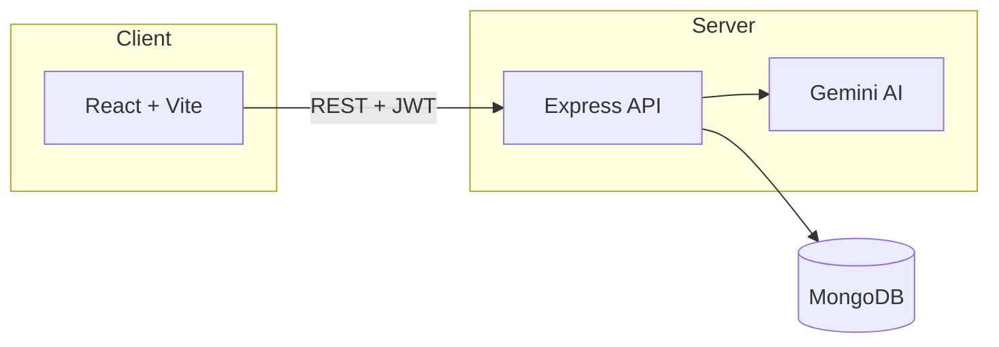

# AI Habit Tracker

A full-stack habit tracking application with AI-powered insights. Build daily routines, track streaks, visualize consistency, and get personalised coaching from Google Gemini.


---

## Features

- **Habit management** — Create, edit, archive, reorder, and delete habits with categories, icons, and weekly targets
- **Daily tracking** — Mark habits complete per day with streak calculation
- **Dashboard** — Today's progress ring, summary cards, and weekly grid
- **Analytics** — Heatmaps, bar charts, completion rates, and per-habit statistics
- **AI coaching** (Gemini)
  - Weekly personalised reports
  - Habit suggestions based on goals
  - Streak recovery plans
  - Data-driven chat Q&A
  - Morning motivation messages
- **Auth** — JWT-based registration and login
- **UI** — Glassmorphism design, dark/light mode, responsive layout

---

## Tech Stack

| Layer | Technologies |
|-------|--------------|
| **Frontend** | React 19, Vite, Tailwind CSS 4, React Router, Axios, Recharts, date-fns |
| **Backend** | Node.js, Express, MongoDB, Mongoose, JWT, bcrypt |
| **AI** | Google Gemini (`@google/genai`) |

---

## Project Structure

```
ai-habit-tracker/
├── backend/
│   ├── config/          # Database connection
│   ├── controllers/     # Route handlers
│   ├── middleware/      # Auth & error handling
│   ├── models/          # Mongoose schemas
│   ├── routes/          # API routes
│   ├── utils/           # AI service, date helpers
│   ├── server.js        # Entry point
│   └── API.md           # Full API reference
├── frontend/
│   ├── src/
│   │   ├── api/         # Axios client
│   │   ├── components/  # UI components
│   │   ├── context/     # Auth & theme
│   │   ├── pages/       # Route pages
│   │   └── utils/       # Helpers & constants
│   └── index.html
└── README.md
```

---

## Prerequisites

- **Node.js** 18+
- **MongoDB** (local or Atlas)
- **Google Gemini API key** (optional — AI falls back gracefully without it)

---

## Getting Started

### 1. Clone the repository

```bash
git clone <repository-url>
cd ai-habit-tracker
```

### 2. Backend setup

```bash
cd backend
npm install
```

Create `backend/.env`:

```env
MONGO_URI=mongodb://localhost:27017/ai-habit-tracker
JWT_SECRET=your_super_secret_key_change_in_production
JWT_EXPIRES_IN=30d
PORT=8000
CLIENT_URL=http://localhost:5173
GEMINI_API_KEY=your_gemini_api_key
GEMINI_MODEL=gemini-2.5-flash
```

Start the API:

```bash
npm run dev
```

Server runs at **http://localhost:8000**

### 3. Frontend setup

```bash
cd ../frontend
npm install
```

Create `frontend/.env`:

```env
VITE_API_URL=http://localhost:8000/api
```

Start the client:

```bash
npm run dev
```

App runs at **http://localhost:5173**

---

## API Documentation

**Base URL:** `http://localhost:8000/api`

> Full reference with request/response examples: **[backend/API.md](./backend/API.md)**

### Authentication

Protected routes require a Bearer token:

```http
Authorization: Bearer <jwt_token>
```

Obtain a token via `POST /api/auth/register` or `POST /api/auth/login`.

**Quick example**

```bash
# Register
curl -X POST http://localhost:8000/api/auth/register \
  -H "Content-Type: application/json" \
  -d '{"name":"Mazen","email":"mazen@example.com","password":"secret123"}'

# Create a habit
curl -X POST http://localhost:8000/api/habits \
  -H "Content-Type: application/json" \
  -H "Authorization: Bearer <token>" \
  -d '{"name":"Read 20 pages","category":"Learning","frequency":"Daily","targetDays":5,"icon":"📚"}'

# Mark complete today
curl -X POST http://localhost:8000/api/logs \
  -H "Content-Type: application/json" \
  -H "Authorization: Bearer <token>" \
  -d '{"habitId":"<habit_id>"}'
```

### Health Check

```http
GET /api/health
```

```json
{ "status": "ok", "timestamp": "2026-06-06T12:00:00.000Z" }
```

### Route Summary

| Method | Endpoint | Auth | Description |
|--------|----------|:----:|-------------|
| `GET` | `/api/health` | | Health check |
| **Auth** | | | |
| `POST` | `/api/auth/register` | | Create account |
| `POST` | `/api/auth/login` | | Login |
| `GET` | `/api/auth/me` | 🔒 | Current user |
| `PUT` | `/api/auth/profile` | 🔒 | Update profile |
| **Habits** | | | |
| `GET` | `/api/habits` | 🔒 | List habits |
| `POST` | `/api/habits` | 🔒 | Create habit |
| `PUT` | `/api/habits/reorder` | 🔒 | Reorder habits |
| `PUT` | `/api/habits/:id` | 🔒 | Update habit |
| `DELETE` | `/api/habits/:id` | 🔒 | Delete habit + logs |
| `PUT` | `/api/habits/:id/archive` | 🔒 | Archive habit |
| **Logs** | | | |
| `POST` | `/api/logs` | 🔒 | Mark habit complete |
| `DELETE` | `/api/logs` | 🔒 | Unmark completion |
| `GET` | `/api/logs/today` | 🔒 | Today's completions |
| `GET` | `/api/logs/range?start=&end=` | 🔒 | Logs in date range |
| `GET` | `/api/logs/heatmap` | 🔒 | 90-day heatmap data |
| `GET` | `/api/logs/stats` | 🔒 | All-habits stats (30d) |
| `GET` | `/api/logs/stats/:habitId` | 🔒 | Single-habit stats |
| **AI** | | | |
| `POST` | `/api/ai/weekly-report` | 🔒 | Weekly AI review |
| `POST` | `/api/ai/suggest-habits` | 🔒 | Habit suggestions |
| `POST` | `/api/ai/recovery-plan` | 🔒 | Streak recovery plan |
| `POST` | `/api/ai/chat` | 🔒 | Ask about your data |
| `GET` | `/api/ai/morning` | 🔒 | Morning motivation |

### Key Request Bodies

<details>
<summary><strong>POST /api/auth/register</strong></summary>

```json
{
  "name": "Mazen",
  "email": "mazen@example.com",
  "password": "secret123"
}
```

</details>

<details>
<summary><strong>POST /api/habits</strong></summary>

```json
{
  "name": "Read 20 pages",
  "description": "Before bed",
  "category": "Learning",
  "frequency": "Daily",
  "targetDays": 5,
  "color": "#a855f7",
  "icon": "📚"
}
```

**Categories:** `Health` · `Fitness` · `Learning` · `Mindfulness` · `Productivity` · `Social` · `Financial` · `Creative` · `Other`

**Frequency:** `Daily` | `Weekly` (case-sensitive)

</details>

<details>
<summary><strong>POST /api/logs</strong></summary>

```json
{
  "habitId": "64a1b2c3d4e5f6789012345",
  "date": "2026-06-06"
}
```

`date` is optional — defaults to today (`yyyy-MM-dd`).

</details>

<details>
<summary><strong>POST /api/ai/suggest-habits</strong></summary>

```json
{
  "goals": "Be healthier and read more",
  "productiveTime": "Early morning",
  "struggles": "Staying consistent on weekends"
}
```

</details>

<details>
<summary><strong>POST /api/ai/chat</strong></summary>

```json
{
  "question": "Which day of the week am I least consistent?"
}
```

</details>

### Error Responses

```json
{ "message": "Human-readable error description" }
```

| Status | Meaning |
|--------|---------|
| `400` | Validation error |
| `401` | Missing or invalid token |
| `404` | Resource not found |
| `500` | Server error |

---

## Environment Variables

### Backend (`backend/.env`)

| Variable | Required | Description |
|----------|:--------:|-------------|
| `MONGO_URI` | ✓ | MongoDB connection string |
| `JWT_SECRET` | ✓ | JWT signing secret |
| `JWT_EXPIRES_IN` | ✓ | Token expiry (e.g. `30d`) |
| `PORT` | | Server port (default `8000`) |
| `CLIENT_URL` | | Allowed CORS origins (comma-separated) |
| `GEMINI_API_KEY` | | Enables real AI responses |
| `GEMINI_MODEL` | | Model name (default `gemini-2.5-flash`) |

### Frontend (`frontend/.env`)

| Variable | Required | Description |
|----------|:--------:|-------------|
| `VITE_API_URL` | ✓ | Backend API URL (e.g. `http://localhost:8000/api`) |

---

## Scripts

### Backend

| Command | Description |
|---------|-------------|
| `npm run dev` | Start with nodemon |
| `npm start` | Start production server |

### Frontend

| Command | Description |
|---------|-------------|
| `npm run dev` | Start Vite dev server |
| `npm run build` | Production build |
| `npm run preview` | Preview production build |
| `npm run lint` | Run ESLint |

---

## Architecture



---

## License

This project is open source and available for personal and educational use.
